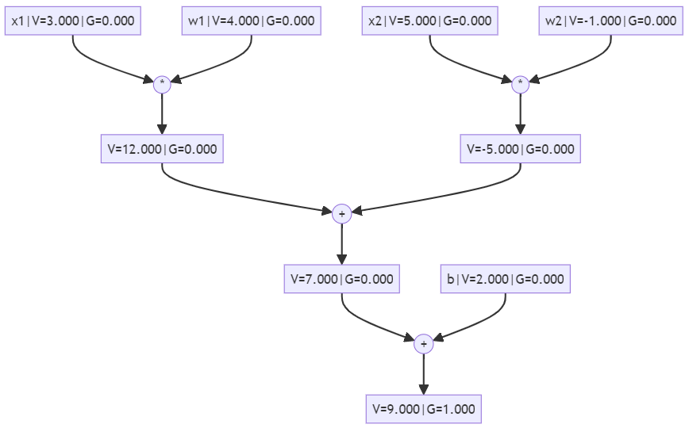

# Autograd C# Polyglot Notebook

This repository contains a C# implementation of a tiny Autograd engine, inspired by [micrograd](https://github.com/karpathy/micrograd) by Andrej Karpathy. The implementation is provided as a Polyglot Notebook, which allows for interactive development and visualization.

The notebook demonstrates how to create a simple neural network, perform forward and backward passes, and visualize the computation graph. It also includes an example of training the network on a small dataset.

## Features

- **Automatic Differentiation**: Implements backpropagation over a dynamically built Directed Acyclic Graph (DAG).
- **Neural Network Components**: Includes classes for `Value`, `Neuron`, `Layer`, and `MLP` (Multi-Layer Perceptron).
- **Visualization**: Uses Mermaid to visualize the computation graph.

## Getting Started

1. **Open the Notebook**: Load the `autograd.dib` file in a Polyglot Notebook environment.
2. **Run the Cells**: Execute the cells interactively to see the implementation and results.
3. **Visualize**: Use the provided `Visualize` method to see the computation graph.

## Requirements

- .NET Interactive
- Polyglot Notebooks extension
- Mermaid for visualizing the computation graph

## Usage

To use this notebook, ensure you have the necessary tools installed and open the `autograd.dib` file in your Polyglot Notebook environment.

For more details, refer to the code and comments within the notebook.

## Acknowledgements

Special thanks to Andrej Karpathy for his inspiring work on [micrograd](https://github.com/karpathy/micrograd).
